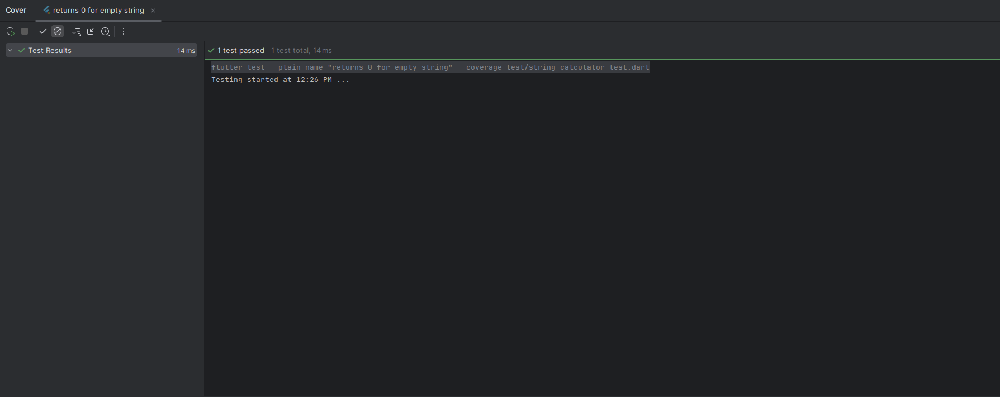
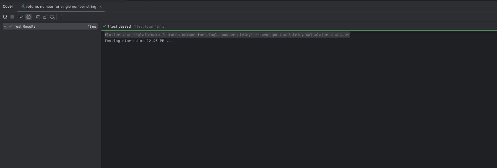
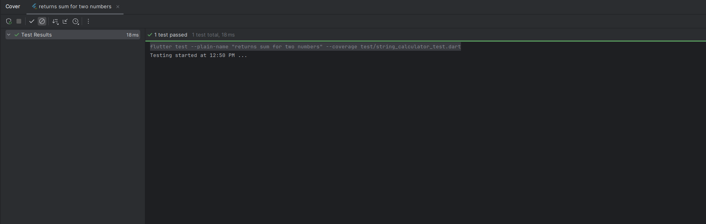
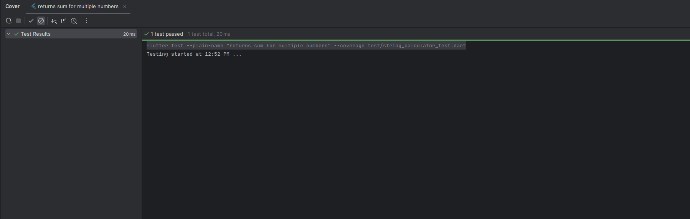
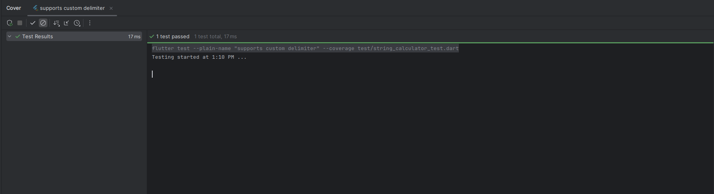
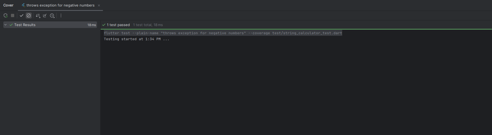

# Incubyte\_tdd

A new Flutter project developed using **Test-Driven Development (TDD)** principles.

---

## Initial Setup

1. **Create a new Flutter project**

    ```bash
    flutter create incubyte_tdd
    ```

2. **Initialize a Git repository**

    ```bash
    git init .
    git switch -C main
    ```

3. **Make the first commit**

    ```bash
    git add .
    git commit -m "Initial Commit"
    ```

4. **Add the `flutter_test` package as a dev dependency**

    ```bash
    flutter pub add dev:test
    ```

---

### TDD Workflow for `StringCalculator`

**Test Case Flow**:

1. Start with an empty string → `add("") → 0`
2. Single number input → `add("5") → 5`
3. Two numbers input → `add("1,2") → 3`
4. Gradually extend to handle multiple numbers and edge cases.

---

### Test Folder Structure

```
lib/
  string_calculator.dart
test/
  string_calculator_test.dart
```

* Test files should mirror the structure of the `lib/` directory.
* Keep tests organized, modular, and easy to maintain.

---

### Step-by-Step Process

We will build the `add(numbers)` function incrementally. For each step, start by writing a test, then implement the corresponding code.

#### Case 1: Empty String

- **Test**: `add("") → 0`
- **Implementation**: Return 0 for an empty string.



#### Case 2: Single Number
- **Test**: `add("5") → 5`
- **Implementation**: Parse the string and return the integer value.


#### Case 3: Two Numbers
- **Test**: `add("1,2") → 3`
- **Implementation**: Split the string by commas, convert to integers, and return the sum.


#### Case 4: Multiple Numbers
- **Test**: `add("1,2,3,4") → 10`
- **Implementation**: Extend the logic to handle multiple numbers.


#### Case 5: Custom Delimiters
- **Test**: `add("//;\n1;2") → 3`
- **Test**: `add('"//;\n"') → 0`
- **Implementation**: Parse custom delimiters and handle them in the addition logic.


#### Case 6: Negative Numbers
- **Test**: `add("1,-2,3")` should throw an exception
- **Implementation**: Check for negative numbers and throw an exception if found.


### Conclusion
By following the TDD approach, we ensure that our `StringCalculator` is built incrementally with a focus on correctness and maintainability. Each step involves writing tests first, then implementing the necessary functionality to pass those tests